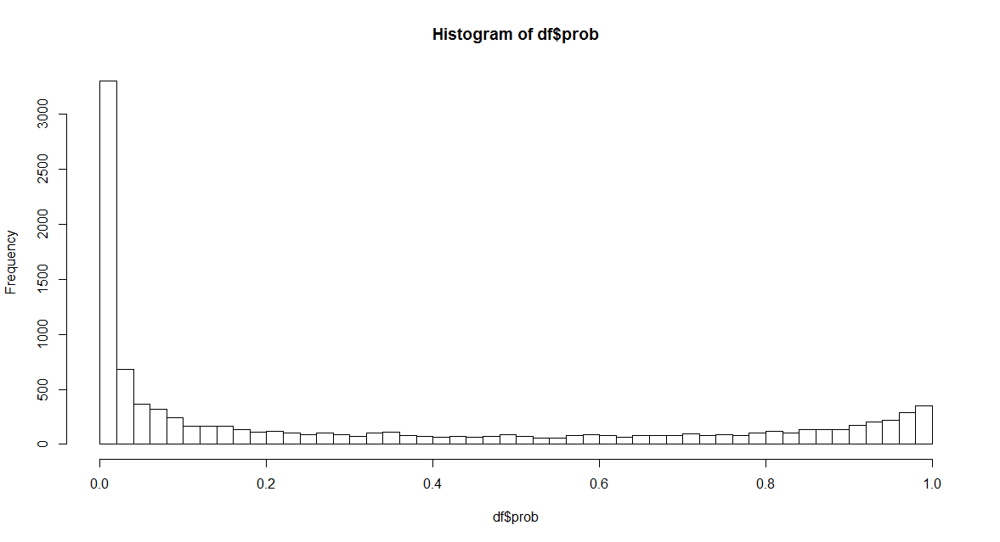
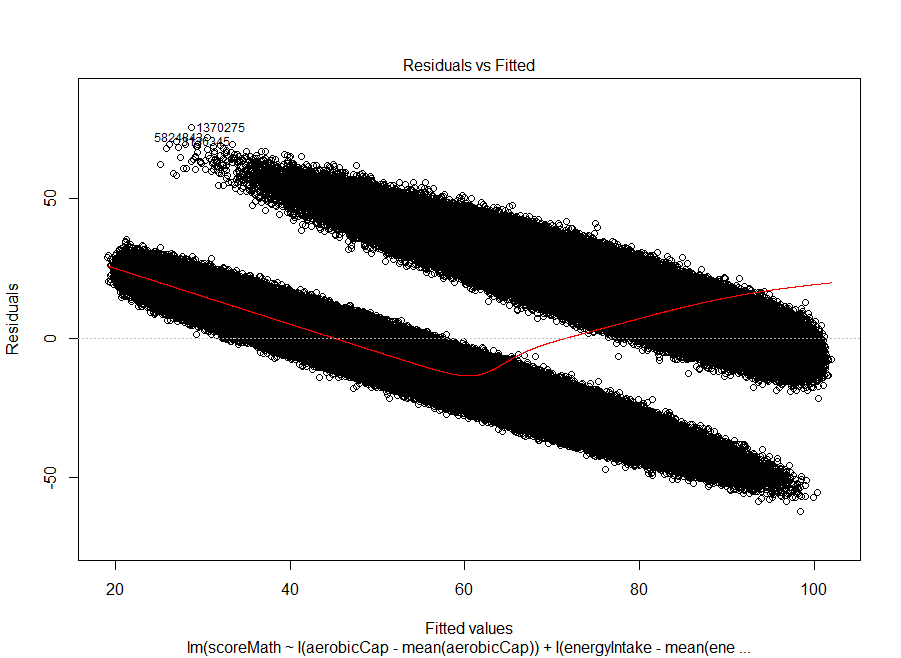
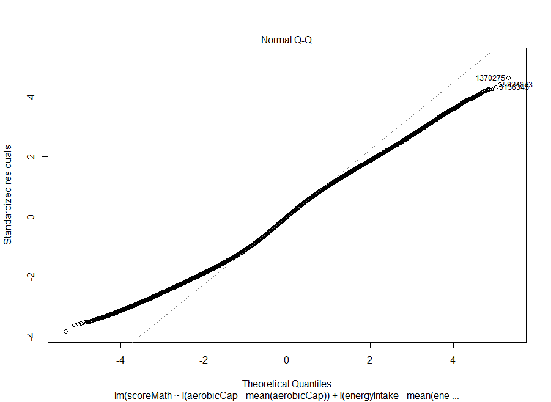
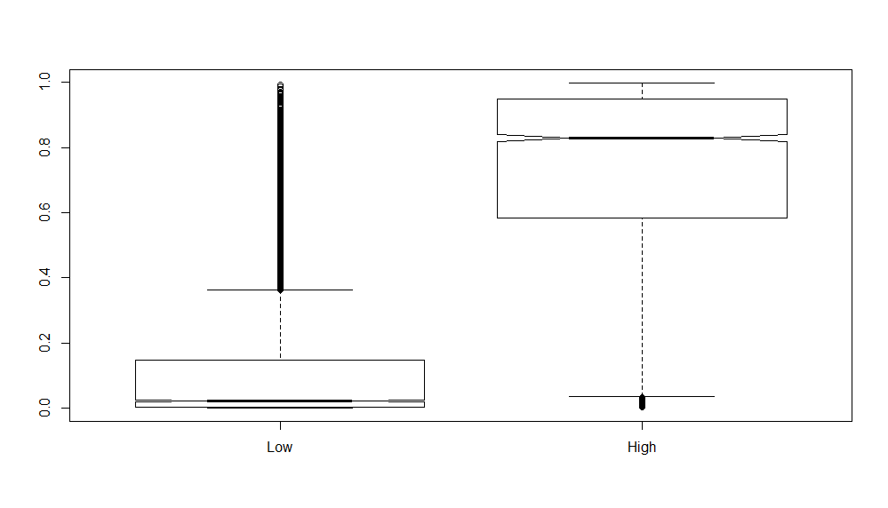
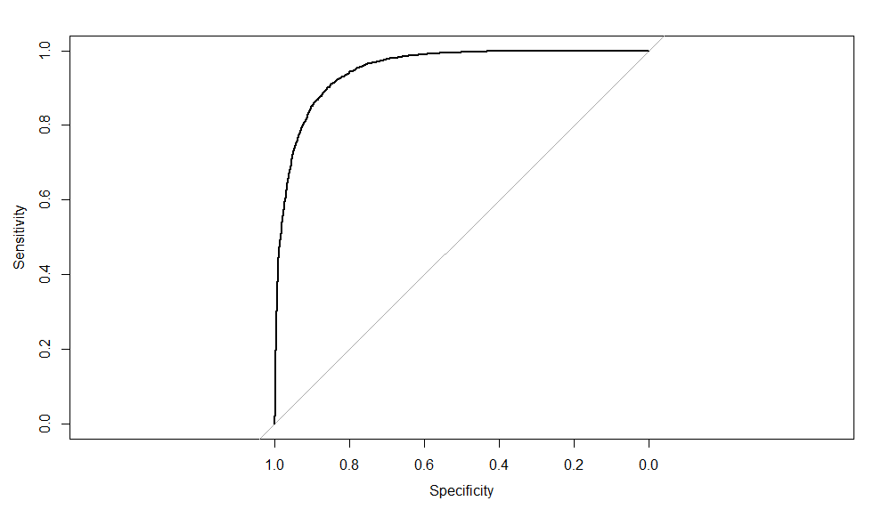

# Data Simulation Project

## Title : Aerobic fitness, micronutrient status, and academic achievement in Indian school-aged children.


Reference Links : http://www.ncbi.nlm.nih.gov/pubmed/25806824

                  http://www.indiachildren.com/htwtc.htm
                  
                  http://www.aarogya.com/family-health/childrens-health
                  
                  http://www.unt.edu/rss/class/mike/5700/Code/R.html
                  
                  http://journals.plos.org/plosone/article?id=10.1371/journal.pone.0122487

## Overview:

 This assignment is based on the paper provided in the above links. The scenario has been altered slightly to suit the needs
 of this assignment, without altering the final analysis. For eg. Kannada has been replaced with English in the score calculation and specific features
 from a large set of features have been chosen to reduce the complexity of the data simulation and analysis.
 
 Aerobic fitness has been shown to have several beneficial effects on child health. However, research on its 
 relationship with academic performance has been limited, particularly in developing countries and among 
 undernourished populations. This study in question examined the association between aerobic fitness and academic achievement 
 in clinically healthy but nutritionally compromised Indian school-aged children and assessed whether 
 micronutrient status affects this association. 273 participants, aged 7 to 10.5 years, were enrolled from 
 three primary schools in Bangalore, India. Data on participants' aerobic fitness (20-m shuttle test), 
 demographics, diet, BMI and micronutrient status were abstracted. School-wide 
 exam scores in mathematics and English language were collected and served as indicators of academic performance and were 
 standardized by grade level. Significant positive correlations between aerobic capacity (VO2 peak)
 and academic scores in math and English were observed.  After standardizing scores across grade levels and adjusting for 
 school, gender, socioeconomic status, and weight status (BMI), children with greater aerobic capacities demonstrated that they had greater odds of scoring above average on math and  English exams. This association remained significant after adjusting for micronutrient deficiencies. These findings 
 provide preliminary evidence of a fitness to academic achievement association in Indian children. While the mechanisms by which aerobic fitness may be linked to academic achievement require further investigation, the results suggest that educators and policymakers should consider that children are given adequate opportunities for physical activity and fitness in schools for both their physical and potential academic benefits. 
 
 The following features were considered:
 
* age  	        Age of the child in years
* speed		      Average speed in a 20m shuttle test in meters/minute
* energyIntake	Total Energy intake/day KCal
* proteinIntake	Total protein intake/day grams
* fatIntake	    Total fat intake/day grams
* carbIntake	  Total carb intake/day grams
* gender		    M or F
* school		    Name of school
* weight		    Weight of the child in kilograms
* height		    Height of the child in centimeters
* bmi		        BMI
* EconomicStatus	Economic status of the child's family
* aerobicCap	  Aerobic Capacity based on the 20M shuttle test
* scoreMath	    Score in Math
* scoreEnglish	Score in English

While this is a classification problem (did the child do good academically or not), the class itself is disguised in quantitative variables Math score and English score to throw in a little challenge to the data analyst.

The snippet of the code below explains how the data is obfuscated to achieve this:
```r
df <- transform(df, score = 0.01 * (aerobicCap - mean(aerobicCap)) + 0.04 * 
                 (energyIntake - mean(energyIntake))+ 481 * (bmi - mean(bmi)) - 2.1)
df$prob <- logistic(df$score)
  
# The outcome is then masked into a range of outcome for high and low scores
df$scoreMath <- round(ifelse(df$prob > runif(N), rnorm(N,mean = 94, sd= 4),
                 rnorm(N,mean = 45, sd= 3)),2)
df$scoreEnglish <- round(ifelse(df$prob > runif(N), rnorm(N,mean = 85, sd= 4),
                 rnorm(N,mean = 40, sd= 3)),2)
```

The coefficients for the transformation were estimated using the manipulate function in R.

```r
## Helper function to calculate cooefficients
library(manipulate)
manipulate({
  df1 <- transform(df, score = 10^a * (aerobicCap - mean(aerobicCap)) + 10^b * 
                 (energyIntake - mean(energyIntake)) + 10^c * (bmi - mean(bmi)) - 2.1)
  df1$prob <- logistic(df$score)
  hist(df1$prob, breaks=50)
}, a=slider(-9, 9, step=0.1, initial = 0), b=slider(-9, 9, step=0.1, initial = 0), 
    c=slider(-9, 9, step=0.1, initial = 0))
    
```
This achieved the following probability distribution:



In order to analyze the data, given that the data gives no indication of classification but looks like a regression problem, it would be appropriate to try to fit the data with linear regression.

```r
fit2 <- lm(scoreMath ~ I(aerobicCap - mean(aerobicCap)) + I(energyIntake - mean(energyIntake)) 
+ I(bmi - mean(bmi)), data=df)
```
The residual vs fitted graph would give the analyst a clear indication of a non-linear relationship




The Q-Q plot would also indicate that a linear fit is not possible



Executing the following piece of code yields a clear demarcation between high and low scores

```r
plot(df$mathCategory, predict(fit1, type="response"), notch=T)
```


Now, plotting the ROC give the following results when this model is considered as a classification problem

```r
df2 <- generateData(10000)
actual <- df2$mathCategory=="High"
predicted <- predict(fit1, newdata=df2, type="link")
library(pROC)
plot.roc(actual,predicted)
```


The following is the code that was used to simulate the data and perform all the analysis mentioned above.

1. Code to simulate the data:

```r
generateData <- function(N=5000){
  
  # The formulae for this function is taken from NCBI website  
  aerobicCapVO2Max <- function (maxSpeed, age){
    return(31.025 + 3.238 * maxSpeed - 3.248 * age + 0.1536 * (maxSpeed * age))
  }
  
  logistic <- function(t) 1 / (1 + exp(-t))
  
  BMI <- function(height, weight) weight/height^2

  ######### Statistical Data #####################
  heightMean <- c(F = 131.3, M = 130.85)
  heightSD <- c(F = 7.8, M = 6.7)
  weightMean <- c(F = 27.75, M = 27.98)
  weightSD <- c(F = 4.5, M = 3.5)
  weight <- rnorm(N,mean = weightMean, sd= weightSD)
  height <- rnorm(N,mean = heightMean, sd= heightSD)
  bmi <- BMI(height,weight)
  age <- runif(N,7,10.5)
  speed <- rnorm(N,mean=9,sd=2)  
  grade <- cut(age,breaks = 7:11,labels = 2:5,right =FALSE)
  aerobicCap <- aerobicCapVO2Max(speed,age) 

  gender <- sample(c("M", "F"), N, replace=TRUE, prob = c(0.498,0.502))
  school <- sample(c("School1", "School2", "School3"), N, replace=TRUE)
  socioEconomicStatus <- sample(c("Low", "Medium", "High"), N, replace=TRUE)

  ########### Micronutrients data ###############
  proteinIntake <- runif(N,21.1,32.7)
  fatIntake <- runif(N,14.7,27.9)
  carbIntake <- runif(N,135,204)
  
  # Converting to calories
  energyIntake <- proteinIntake *4 + fatIntake *9 + carbIntake * 4
  ############################################### 
  
  df<- data.frame(age,speed,energyIntake,proteinIntake,fatIntake,carbIntake,gender,school,
      weight,height,bmi,socioEconomicStatus,aerobicCap)
  
  df <- transform(df, score = 0.01 * (aerobicCap - mean(aerobicCap)) + 0.04 * 
        (energyIntake - mean(energyIntake))+ 66 * (bmi - mean(bmi)) - 2.1)
  df$prob <- logistic(df$score)
  hist(df$prob, breaks=50)
  
  # The outcome is then masked into a range of outcome for high and low scores
  df$scoreMath <- round(ifelse(df$prob > runif(N), rnorm(N,mean = 94, 
                  sd= 4),rnorm(N,mean = 45, sd= 3)),2)
  df$scoreEnglish <- round(ifelse(df$prob > runif(N), rnorm(N,mean = 85, 
                  sd= 4),rnorm(N,mean = 40, sd= 3)),2)
  df$mathCategory <- factor(ifelse (df$scoreMath > 70, "High", "Low"),
                  levels=c("Low", "High"))
  df$engCategory <- factor(ifelse (df$scoreEnglish > 65, "High", "Low"),
                  levels=c("Low", "High"))
  return(df)
  
}
```

2. The function to create the data frame object with the simulated data
```r
N <- 10000
df <- generateData(N)
```

3. Cross validation using the glm() function to try and get back the cooefficients

```r
fit1 <- glm(mathCategory ~ I(aerobicCap - mean(aerobicCap)) + I(energyIntake - 
        mean(energyIntake)) + I(bmi - mean(bmi)), data=df, family="binomial")
coef(fit1)
summary(fit1)

```
```r

----- Output --------
Call:
glm(formula = mathCategory ~ I(aerobicCap - mean(aerobicCap)) + 
    I(energyIntake - mean(energyIntake)) + I(bmi - mean(bmi)), 
    family = "binomial", data = df)

Deviance Residuals: 
    Min       1Q   Median       3Q      Max  
-3.2048  -0.3535  -0.0826   0.2891   3.5176  

Coefficients:
                                       Estimate Std. Error z value Pr(>|z|)    
(Intercept)                          -2.070e+00  5.245e-02 -39.455  < 2e-16 ***
I(aerobicCap - mean(aerobicCap))      1.516e-02  3.653e-03   4.148 3.35e-05 ***
I(energyIntake - mean(energyIntake))  3.985e-02  8.492e-04  46.924  < 2e-16 ***
I(bmi - mean(bmi))                   -6.920e+01  1.132e+02  -0.611    0.541    
---
Signif. codes:  0 '***' 0.001 '**' 0.01 '*' 0.05 '.' 0.1 ' ' 1

(Dispersion parameter for binomial family taken to be 1)

    Null deviance: 12531.4  on 9999  degrees of freedom
Residual deviance:  5481.2  on 9996  degrees of freedom
AIC: 5489.2

Number of Fisher Scoring iterations: 7

```

As can be seen, the coefficients are very close to the original coefficients considered in the equation.

```r

  df <- transform(df, score = 0.01 * (aerobicCap - mean(aerobicCap)) + 0.04 * 
        (energyIntake - mean(energyIntake))+ 66 * (bmi - mean(bmi)) - 2.1)
```
 